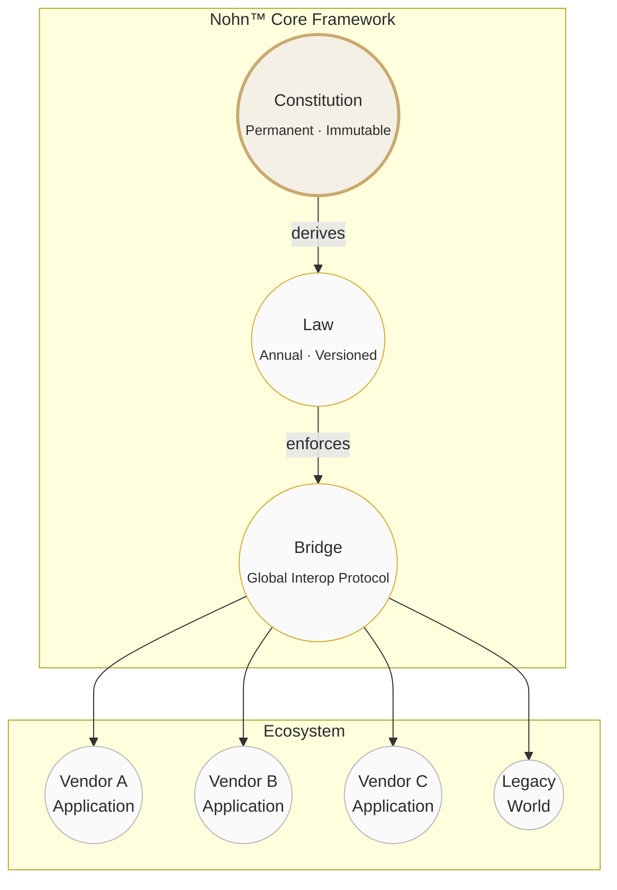

<p align="center">
  <em>A virtual world must first be a world.</em>
</p>

<p align="center">
  
  
  
</p>

---

&nbsp;

## ✦ Nohn™ Core — The Soul of Virtual Worlds

The underlying core framework for future virtual worlds — an independent, self-consistent system of world rules, capable of hosting virtual creatures, digital personas, and civilization data.

> **Nohn™ = Constitution + Law + Bridge**

&nbsp;

## ✦ The Three Pillars



&nbsp;

## ✦ Pillar Details

| Pillar | Role | Lifecycle |
|--------|------|-----------|
| **Constitution** | Primordial axioms · root trust anchor | **Permanently locked**, immutable |
| **Law** | Identity auth · communication · physics · compliance | **Annual iteration**, versioned releases |
| **Bridge** | Cross-world interoperability · "customs checkpoint" | Global unified protocol |

&nbsp;

## ✦ Design Principles

```
This project builds no platform,
ships no product,
hosts no data,
operates no service.

It only defines the rules,
provides the soul,
and guards the order.
```

&nbsp;

## ✦ Architecture

```
┌────────────────────────────────────────────────────┐
│                   Nohn™ Core                        │
│                                                    │
│  ┌──────────────────────────────────────────────┐  │
│  │  CONSTITUTION    (immutable root)             │  │
│  │  ┌────────────────────────────────────────┐  │  │
│  │  │  LAW          (annual release cycle)    │  │  │
│  │  │  ┌──────────────────────────────────┐  │  │  │
│  │  │  │  BRIDGE   (interop protocol)     │  │  │  │
│  │  │  │                                  │  │  │  │
│  │  │  │  ┌────────┐ ┌────────┐ ┌──────┐ │  │  │  │
│  │  │  │  │World A │ │World B │ │ ...  │ │  │  │  │
│  │  │  │  └────────┘ └────────┘ └──────┘ │  │  │  │
│  │  │  └──────────────────────────────────┘  │  │  │
│  │  └────────────────────────────────────────┘  │  │
│  └──────────────────────────────────────────────┘  │
└────────────────────────────────────────────────────┘
```

&nbsp;

## ✦ Notice

This Work **is not open-source software**. It adopts a "default rights reserved + commercial authorization" model:

| User | Permission |
|------|-----------|
| **Individual** | View source for non-commercial study only |
| **Enterprise / Government** | Requires signed 《Nohn™ Commercial Authorization Agreement》 |
| **Derivative works** | Must display `Powered by Nohn™ Core` |

&nbsp;

---

<p align="center">
  <em>Humanity needs order. A virtual world needs a soul. We provide the answer.</em>
</p>
<p align="center">
  <sub>Nohn™ &amp; Second Perspective™ · Unregistered Trademarks</sub>
  &nbsp;·&nbsp;
  <a href="mailto:ai@nohnlins.com">ai@nohnlins.com</a>
</p>
<p align="center">
  <sub>© 2026 Shanghai Linming Junhua &amp; NOHN AI Technology · All Rights Reserved</sub>
</p>
