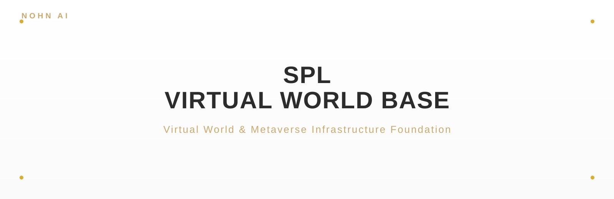

<p align="center">
  
</p>

<p align="center">
      
</p>

<blockquote align="center">
  <em>Virtual World & Metaverse Infrastructure Foundation</em>
</blockquote>

<div style="max-width:880px;margin:0 auto;padding:0 16px">

## ✦ About

<p style="font-size:15px;line-height:1.8;color:#2C2C2C">SPL-VIRTUAL-WORLD-BASE 是虚拟世界与元宇宙的基础设施框架，以「宪法—法律—Bridge」三层架构为基座，为虚拟空间提供可治理、可互操作、可演化的运行底座。它让不同世界之间的资产、规则与代理得以稳定桥接与协同。</p>

<p align="center">
  
</p>

</div>

<p align="center">— ✦ —</p>

## ✦ Quick Start

```bash
git clone git@github.com:NOHN-AI/SPL-VIRTUAL-WORLD-BASE.git
cd SPL-VIRTUAL-WORLD-BASE
pip install -r requirements.txt
python world.py --init demo
```

<p align="center">— ✦ —</p>

<p align="center">
  <a href="https://github.com/NOHN-AI">NOHN-AI</a>
  &nbsp;·&nbsp;
  <a href="https://www.nohnlins.com/">nohnlins.com</a>
  &nbsp;·&nbsp;
  <a href="mailto:ai@nohnlins.com">ai@nohnlins.com</a>
</p>
<p align="center"><sub>NOHN AI · SPL-VIRTUAL-WORLD-BASE</sub></p>
