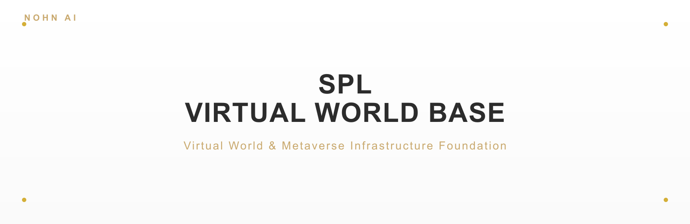
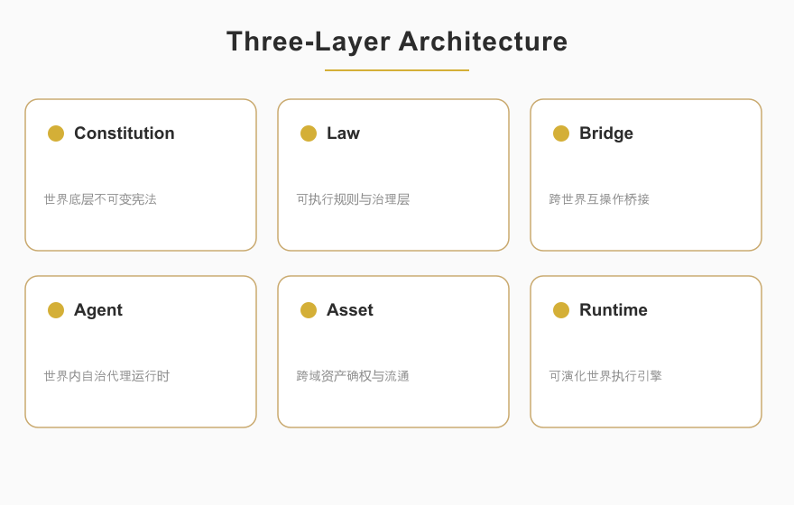

<p align="center">
  
</p>

<p align="center">
  
  
  
  
</p>

<blockquote align="center">
  <em>Virtual World &amp; Metaverse Infrastructure Foundation</em>
</blockquote>

<div style="max-width:880px;margin:0 auto;padding:0 16px">

## ✦ About

<p style="font-size:15px;line-height:1.8;color:#2C2C2C">SPL-VIRTUAL-WORLD-BASE is the infrastructure framework for virtual worlds and metaverses, built on a three-layer architecture — Constitution, Law, and Bridge — providing a governable, interoperable, and evolvable runtime foundation for virtual spaces. It enables stable bridging and collaboration of assets, rules, and agents across different worlds. A second-perspective cognitive auditor acts as the neutral referee of the entire stack.</p>

<p align="center">
  
</p>

</div>

<p align="center">— ✦ —</p>

## ✦ Quick Start

```bash
# Primary: GitHub (repository name: Second-Reality)
git clone https://github.com/nohn3043-arch/Second-Reality.git
# Mirror: Gitee
# git clone https://gitee.com/nohn-ecosystem/SPL-virtual-world-core.git
cd SPL-virtual-world-base
# Pure Python ≥3.8 — standard library only, nothing to install
# Launch the GUI demo (requires a graphical environment; spawns two built-in agents)
python virtual_world.py
```

Programmatic start:

```python
from virtual_world import NohnWorld, NohnVisualApp
nexus = NohnWorld()
nexus.spawn("Explorer_01", "e3b0c44298fc1c149afbf4c8996fb92427ae41e4649b934ca495991b7852b855")
NohnVisualApp(nexus).root.mainloop()
```

<p align="center">— ✦ —</p>

## ✦ Architecture

<div style="max-width:880px;margin:0 auto;padding:0 16px">

The stack is organized as four separable layers, so that rules (read-only), the auditor (neutral referee), the system (implementation), and the demo client never conflate:

- **Constitution rules** (`constitution_rules.py`) — the primordial axioms and ten governance laws, permanently locked as the root trust anchor. `NOHN_LAW_AXIOMS` is the single authoritative source for all constants.
- **Audit engine** (`audit_engine.py`) — the second-perspective cognitive auditor (`ResponsibilityAccount` + pluggable `AuditPlugin`s + `SecondPerspectiveAuditor` with an 18-dimension compliance review). It is the *referee*, not part of the world.
- **Law** (`law/`) — four standard layers:
  - *Communication protocol standard*
  - *Global economic unified standard* — currency, peg, proof-of-reserve, redemption
  - *Identity attestation standard* — soul-hash bound identity
  - *Physics baseline standard* — gravity / time / scale constants
- **System** (`system/`) — the real implementation layer: persistent ledger, ≥2/3 referendum consensus, agent engine, headless runtime, REST/WS API, machine-readable protocol schemas, and production security.
- **Bridge** (`compatibility_bridge.py`) — the only "customs" through which legacy worlds join Nohn territory:
  - `translate_intent()` — semantic wash: maps vendor-private instructions to the Nohn standard vocabulary, stripping hidden interpretation rights.
  - `check_physics_constants()` — rejects worlds whose physics constants diverge from `NOHN_LAW_AXIOMS`.
  - `verify_soul_hash()` — verifies identity against the soul-hash anchor.

The demo runtime (`virtual_world.py`) wires these together with an `EconomySystem`, `TaskGenerator`, and `NohnAgent`, mounted on the real `system.World`.

</div>

<p align="center">— ✦ —</p>

## ✦ Architecture Modules

<div style="max-width:880px;margin:0 auto;padding:0 16px">

Every class below is verified against the current source. Grouped by the six layers of the Nohn™ world stack:

| Layer | Module (class) | Responsibility |
|---|---|---|
| **Constitution** | `SpatialSubstrate` | world topology, dimensions, boundaries, minimal units |
| | `TemporalSubstrate` | time flow and event sequencing |
| | `CausalClosure` | causal-chain tracking, external intervention detection |
| | `ExistenceAxiom` | entity creation, verification, and destruction |
| | `GenesisCondition` | world initialization and integrity validation |
| | `ImmutableWorldRule` | rules that require global referendum to amend |
| | `WorldCentralBrain` | central coordination of world subsystems |
| **Soul** | `SoulAttestation` | soul registration and verification |
| | `SoulLedger` | identity ledger |
| | `MemoryInalienability` | memory non-seizability |
| | `MemoryGuardian` | memory sealing and tamper detection |
| | `IndependentWill` | autonomous will (MARL-based, not behavior trees) |
| | `MemoryVault` | secure memory storage |
| **Audit** | `ResponsibilityAccount` | named accountability for every governance action |
| | `AuditPlugin` | pluggable audit checks |
| | `CognitiveAuditEngine` | cognitive-audit engine core |
| | `SecondPerspectiveAuditor` | comprehensive compliance review |
| | `DecentralizationGovernance` | decentralized governance |
| | `AestheticCompliance` | aesthetic/rendering compliance |
| | `AuditReport` | structured audit report |
| **Perpetuity** | `WorldPerpetuity` | eternal world-running record |
| | `HistoryLedger` | history ledger |
| | `SnapshotRegistry` | snapshot registration and recovery |
| **Interoperability** | `NohnCompatibilityBridge` | cross-world bridge protocol |
| | `MandatoryInteroperability` | mandatory interop protocol |
| | `UniversalVocabulary` | universal semantic vocabulary |
| | `PhysicsBaseline` | physics baseline alignment |
| | `IdentityProtocol` | identity protocol compatibility |
| | `EconomicBaseline` | economic standard compliance |
| **Runtime** | `NohnWorld` | world container |
| | `NohnAgent` | agent |
| | `EconomySystem` | economy system |
| | `TaskGenerator` | task generation |
| | `NohnVisualApp` | visualization app |
| | `ConsensusEngine` | consensus among world actors |
| | `SimulationEngine` | world simulation loop |
| **System** | `World` (`system/runtime.py`) | genesis assembly + tick loop + 18-dimension audit + snapshot |
| | `Storage` · `SoulLedger` · `HistoryLedger` · `EconomicReserve` · `SnapshotRegistry` (`system/ledger.py`) | persistent SQLite ledgers (soul / history / economy / snapshots) |
| | `ConsensusNetwork` · `Governance` (`system/consensus.py`) | ≥2/3 referendum consensus + governance |
| | `Agent` (`system/agent_engine.py`) | need-driven agent + memory sealing |
| | `ProtocolValidator` (`system/protocol.py`) | machine-readable law validation + on-boarding |
| | `SoulAuth` · `WorldAPI` · `serve()` (`system/api.py`) | REST + WebSocket + HMAC auth |

</div>

<p align="center">— ✦ —</p>

## ✦ Enterprise Usage

<div style="max-width:880px;margin:0 auto;padding:0 16px">

The base is a **protocol guardian + reference implementation**, not a single-operator platform. An enterprise integrates in one of three ways:

### A. Protocol Participant (self-hosted, data stays on-premise)

Run your own implementation inside your own data center, conforming to the four `law/` standards, and validate on-boarding before joining the network:

```python
from system.protocol import ProtocolValidator

ok, failures = ProtocolValidator().validate(world_config)
# ok=True  -> on-board to the Nohn network
# ok=False -> isolated at the failed layer(s)
```

**Hard constraint**: your raw data (souls, assets, memories, world state) never leaves your data center. The protocol layer exchanges only verifiable proofs — hashes, signatures, Merkle roots, proof-of-reserve — never raw data.

### B. Reference Implementation (embedded)

Use the audited reference world directly:

```python
from system.runtime import World

world = World("my-world", data_dir="./my_data")
world.spawn_agent("ab" * 32)
world.tick()
print(world.audit_summary())   # 18-dimension second-perspective audit
```

### C. API Integration (REST + WebSocket)

Run the service and integrate over HTTP:

```python
from system.api import serve
serve(world, host="0.0.0.0", port=8000)
```

Key endpoints: `GET /health`, `GET /world`, `GET /audit`, `POST /protocol/validate`, `POST /agent/spawn`, `POST /auth/issue`, `GET/POST /economy/*`, `WS /ws/world`.

### Customization boundary

Enterprise-specific differences live in the **configuration layer** (industry parameters, jurisdiction, deployment topology) — never in the core constitution, audit, or consensus rules, which remain identical for every enterprise.

</div>

<p align="center">— ✦ —</p>

## ✦ Project Structure

```
SPL-Virtual-world-base/
├── constitution_rules.py        # constitution rules: axioms + ten governance laws + NOHN_LAW_AXIOMS
├── audit_engine.py              # second-perspective auditor: 18-dimension compliance review
├── constitution.py              # thin aggregate layer (backward-compatible re-export)
├── compatibility_bridge.py      # legacy-world "customs": semantic wash + physics/soul checks
├── virtual_world.py             # demo runtime (GUI/headless), mounted on system.World
├── system/                      # real implementation layer
│   ├── ledger.py                #   persistent Soul/History/Economic ledger (SQLite)
│   ├── consensus.py             #   ≥2/3 referendum consensus + governance
│   ├── agent_engine.py          #   need-driven agents + memory sealing
│   ├── runtime.py               #   genesis assembly + tick loop + audit report
│   ├── api.py                   #   REST + WebSocket + HMAC auth
│   ├── protocol.py              #   machine-readable law schemas + validator
│   └── keys.py                  #   signing key management
├── law/                         # Communication / Economic / Identity / Physics standards
├── assets/                      # banner.svg/png, overview.svg/png
└── LICENSE
```

<p align="center">— ✦ —</p>

## ✦ Ecosystem

SPL-VIRTUAL-WORLD-BASE is one member of the NOHN AI ecosystem — a family of projects built around second-perspective causal audit and deterministic execution:

| Project | Repository | What it is |
|---|---|---|
| **Second-Perspective (GCAE)** | [nohn3043-arch/second-perspective](https://github.com/nohn3043-arch/second-perspective) | Global cognitive audit engine — the five-operator causal audit core (IMDA 95/100) |
| **NOMOS** | [nohn3043-arch/second-perspective](https://github.com/nohn3043-arch/second-perspective) (`Intelligent-Decision-Hub--Nomos` branch) | Auditable deterministic decision hub (IMDA 95/100) |
| **SPL-G1** | [nohn3043-arch/SPL-G1-General-purpose-processor](https://github.com/nohn3043-arch/SPL-G1-General-purpose-processor) | Hardware causal-audit Trusted Compute Unit (TCU) |
| **SPL-Virtual-World-Base** | [nohn3043-arch/Second-Reality](https://github.com/nohn3043-arch/Second-Reality) | Virtual-world & metaverse infrastructure (Constitution / Law / Bridge) |
| **Story-Engine** | [nohn3043-arch/story-engine](https://github.com/nohn3043-arch/story-engine) | Long-form narrative consistency engine |
| **Antares** | [nohn3043-arch/Antares](https://github.com/nohn3043-arch/Antares) | GFSIP v1.0 — federated stable interoperability protocol with causal audit |
| **Anthropomorphic-Agent-Engine** | [nohn3043-arch/Anthropomorphic-Agent-Engine](https://github.com/nohn3043-arch/Anthropomorphic-Agent-Engine) | Deterministic anthropomorphic psychology engine (SPL Pure Core V8.0) |
| **PAGES** | [nohn3043-arch/pages](https://github.com/nohn3043-arch/pages) | Official NOHN AI ecosystem landing page |

<p align="center">— ✦ —</p>

## ✦ License & Authorization

This repository is **not open-source**. Dual-track model: free for individual non-commercial research; paid commercial authorization required for government / enterprise. See [LICENSE](./LICENSE).

**Trademark notice**: "Nohn™" and "Second Perspective™" are unregistered trademarks in the virtual-world domain, protected under unfair-competition law and common-law passing-off doctrine. Any unauthorized commercial use constitutes infringement.

**Licensing inquiries**:
- International / Global: [ai@nohnlins.com](mailto:ai@nohnlins.com)
- China: [lin@secondai.top](mailto:lin@secondai.top)

<p align="center">
  <a href="https://github.com/nohn3043-arch">GitHub</a>
  &nbsp;·&nbsp;
  <a href="https://www.nohnlins.com/">nohnlins.com</a>
  &nbsp;·&nbsp;
  <a href="mailto:ai@nohnlins.com">ai@nohnlins.com</a>
</p>
<p align="center"><sub>NOHN AI · SPL-VIRTUAL-WORLD-BASE</sub></p>
